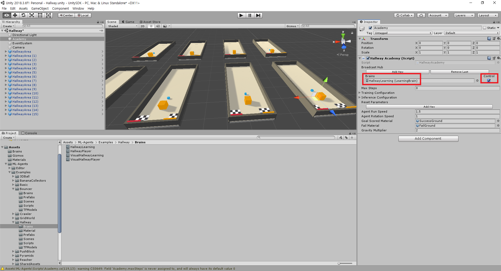

# Build Enviromnet

## 1. Choose Enviroment

먼저 자기가 원하는 scenes 파일을 열고 Academy 파일을 클릭하면
그림처럼 화면이 뜨는데 

이때 Brains에서 Brain이 LearningBrain인지 확인하고 옆에 Contorl 체크박스를 체크해준다. 

## 2. Building Enviormnet

왼쪽 위에 file탭안에 Build settings를 클릭합니다.

그러면 이런 창이 나올텐데 이떄 Build 버튼을 클릭해준다.

그리고 자신이 저장하고 싶은 폴더를 선택해준다.

unity 버전에 따라 다르겠지만 만약 그림처럼 파일이름이 Unity Enviroment로 되어있으면 

자신이 바꾸고 싶은 이름으로 바꿔준다.(그대로 Unity Enviroment로 써도되지만 파일 구별을 위해 바꿔주다.)

